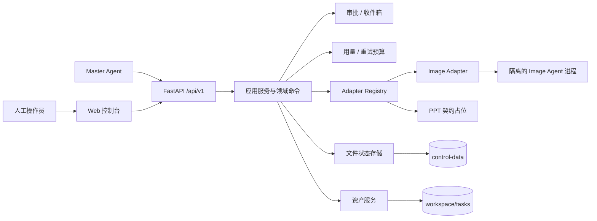

# Agentic Design Harness

面向平面设计工作流的多智能体控制平面：统一编排专业 Agent，管理人工审批、隔离进程、受控资产、用量预算和可恢复状态。

> 当前版本：`0.2.0`（Phase 1）。已完成 Image Agent 的单机闭环；PPT 任务可以建模和展示，但 PPT Agent 尚未接入实际运行。当前版本适合本地开发、单用户验证与方案集成，不是多租户生产平台。

## 项目概览

传统的“一个 Agent 包办全部工作”很难同时保证进程隔离、人工控制、文件可信度和故障恢复。本项目把这些横切能力放进独立 Harness，让 Image、PPT 等专业 Agent 保持自治，并通过稳定契约接入。

核心能力包括：

- **任务编排**：支持 Image-only、PPT-only 和 Image → PPT 三种计划拓扑，统一管理任务、阶段和实例状态。
- **Agent 隔离**：每个运行实例使用独立进程、端口、目录、凭据和配置快照；Harness 不导入专业 Agent 的内部 Python 包。
- **人工审批**：提供固定 Owner 的审批流和 FIFO 收件箱，关键步骤可由人工或 Master Agent 接管。
- **资产可信**：输入和交付均通过受控目录流转，发布时校验 MIME、大小与 SHA-256，避免直接信任外部文件路径。
- **用量与预算**：聚合 Token、图片计费单位和费用完整性，按任务控制自动重试预算与人工越权。
- **配置与密钥**：支持全局配置、实例配置和凭据池；公开 API 只返回脱敏信息。
- **审计与恢复**：写操作带 Actor、幂等键和 revision；状态采用事件提交、原子快照和可重建索引。
- **Web 控制台**：集中查看任务、实例、审批、资源、Token/费用、事件和配置；专业创作界面通过 Agent 深链打开。

## 系统架构



后端依赖方向保持为 `API → application/domain → storage/adapters`。跨模块数据结构由 `contracts/v1` 中的 JSON Schema 固定，前端类型从这些契约生成。

## 运行要求

| 项目 | 要求 |
| --- | --- |
| 操作系统 | Linux / POSIX；运行时依赖 `/proc`、`fcntl` 和进程组控制 |
| Python | 3.10+；CI 覆盖 3.10 与 3.13 |
| Node.js | 22+ |
| 其他工具 | npm、GNU Make、Git |
| Image Agent | 仅启动真实 Image 工作流时需要；源码和依赖必须使用固定版本 |

Windows 和 macOS 当前不能作为正式运行主机；不满足进程隔离条件时，后端会直接拒绝启动。

## 快速开始

### 1. 获取代码

```bash
git clone https://github.com/HST314/agentic-design-harness.git
cd agentic-design-harness
```

### 2. 安装依赖

```bash
# 后端开发与测试依赖会安装到仓库内的 .test-deps，不污染全局环境
make test-env

# 前端依赖
npm --prefix frontend ci
```

### 3. 配置后端（可选）

默认配置可以直接启动空控制平面。需要自定义数据目录、监听地址或 Image Agent 路径时：

```bash
cp config/harness.example.yaml config/harness.local.yaml
export HARNESS_CONFIG=config/harness.local.yaml
```

常用环境变量会覆盖 YAML 中的同名配置：

| 环境变量 | 默认值 | 说明 |
| --- | --- | --- |
| `HARNESS_HOST` | `127.0.0.1` | 后端监听地址 |
| `HARNESS_PORT` | `18080` | 后端监听端口 |
| `HARNESS_CONTROL_ROOT` | `control-data` | 控制状态、事件和密钥目录 |
| `HARNESS_WORKSPACE_ROOT` | `workspace` | 任务输入与交付目录 |
| `HARNESS_IMAGE_AGENT_ROOT` | `../image_agent_mvp` | Image Agent 源码目录 |
| `HARNESS_IMAGE_AGENT_PYTHON` | `/usr/bin/python3` | Image Agent 解释器 |
| `HARNESS_IMAGE_AGENT_REVISION` | 固定提交 | 允许启动的 Image Agent 版本 |

凭据不能写入 YAML 或 `.env` 后提交到 Git。请通过受控的 `/api/v1/key-pool` 接口写入，公开响应只会返回 Key ID、尾号和 Base URL 提示。

### 4. 启动控制平面

终端一：

```bash
make serve
```

启动后可访问：

- API：<http://127.0.0.1:18080>
- 健康检查：<http://127.0.0.1:18080/healthz>
- 就绪检查：<http://127.0.0.1:18080/readyz>
- Swagger UI：<http://127.0.0.1:18080/docs>
- OpenAPI：<http://127.0.0.1:18080/openapi.json>

终端二：

```bash
npm --prefix frontend run dev
```

浏览器打开 <http://127.0.0.1:18180>。Vite 会把 `/api`、`/healthz` 和 `/readyz` 代理到本地后端；如后端地址不同，启动前设置 `HARNESS_BACKEND_URL`。

### 5. 创建第一个任务

当前 Web 控制台用于管理和观察任务，任务创建与计划提交由 Master Agent 或 API 完成。下面的请求会创建一个可在控制台中看到的空任务：

```bash
curl --request POST http://127.0.0.1:18080/api/v1/tasks \
  --header 'Content-Type: application/json' \
  --data '{
    "task_id": "task_campaign_01",
    "title": "Campaign visual",
    "goal": "Create a reviewable campaign visual.",
    "master_owner": "master_default",
    "start_policy": "manual",
    "input_manifest": "inputs/manifests/input_rev_1.json",
    "envelope": {
      "idempotency_key": "create_task_campaign_01",
      "actor_type": "master",
      "actor_id": "master_default",
      "expected_revision": 0
    }
  }'
```

完整业务顺序是：创建任务 → 导入输入 → 保存计划与任务卡 → 确认启动 → 处理审批 → 验证交付。字段定义和可直接试用的请求体均可在 Swagger UI 中查看；编排规则见 [Master API 调用指南](docs/master-api-guide.md)。

## 接入 Image Agent

真实 Image 工作流要求 Image Agent 源码位于配置指定目录，且 Git revision 与 `image_agent_revision` 完全一致。准备其隔离依赖：

```bash
make image-agent-env IMAGE_AGENT_ROOT=../image_agent_mvp
```

先运行不调用外部模型的真实进程门禁：

```bash
make g2-e2e IMAGE_AGENT_ROOT=../image_agent_mvp
make g3-e2e IMAGE_AGENT_ROOT=../image_agent_mvp
```

G3 覆盖“人工确认 → 真实 Adapter/进程 → 受控发布 → 主任务完成”。多实例、凭据轮转、配置覆盖、用量和取消链路使用：

```bash
make g4-e2e IMAGE_AGENT_ROOT=../image_agent_mvp
```

需要访问真实模型 Provider 时，请使用专用测试凭据文件，并先执行预检：

```bash
make real-provider-preflight \
  REAL_PROVIDER_ENV_FILE=/secure/provider.env

make real-provider-smoke \
  IMAGE_AGENT_ROOT=../image_agent_mvp \
  REAL_PROVIDER_ENV_FILE=/secure/provider.env
```

真实门禁会检查 Harness 与 Image Agent 的提交身份和工作树清洁度；证据不会记录 API Key、完整 Provider URL、请求正文或模型响应正文。详细变量与故障排查见 [运行手册](docs/operations.md)。

## 测试与质量门禁

测试脚本是发布能力的一部分，仓库精简不会删除它们。

| 命令 | 用途 |
| --- | --- |
| `make test` | 契约、单元、集成、崩溃恢复和可用的 E2E 测试 |
| `make check` | 测试、Ruff、compileall、密钥扫描、边界检查、前端类型检查与构建 |
| `make verify` | `check` + Pyright + Python/npm 漏洞审计 + SBOM + 容量基准 |
| `npm --prefix frontend run test:e2e` | Playwright 浏览器测试 |
| `make g5-e2e IMAGE_AGENT_ROOT=../image_agent_mvp` | Phase 1 完整离线发布门禁与证据索引 |

`make test` 在未提供合格 Image Agent 环境时会按设计跳过真实 Agent 用例；这不等同于真实链路已通过。发布前应根据目标范围执行对应的 G2–G5 门禁。

## 数据、安全与恢复

- `control-data/` 保存控制状态、事件、配置投影和受限凭据；`workspace/tasks/` 保存任务输入与交付。两者默认不会进入 Git。
- 一致备份必须同时包含上述两个目录，并在停止新写入、正常关闭 Harness 后执行。
- 不要直接修改状态文件，也不要通过重新发送 start/advance 命令修复恢复状态；启动流程会重建安全投影并对账活动实例。
- 默认服务只监听 `127.0.0.1`。当前没有登录、RBAC 或多租户隔离，不能直接暴露到公网；跨主机访问应置于受信反向代理和网络访问控制之后。
- `healthz` 只代表进程存活；只有 `readyz` 返回 `ready` 才表示契约注册与唯一写者租约均已就绪。

备份、升级、回滚和故障排查步骤见 [运行手册](docs/operations.md)。

## 项目结构

```text
backend/harness/   FastAPI、领域命令、应用服务、Adapter 与文件状态存储
frontend/          TypeScript/Vite 控制台与 Playwright 测试
contracts/v1/      JSON Schema、状态/错误目录及示例
config/            非敏感配置样例与容量 SLO
requirements/      人工维护的 Python 顶层依赖输入
scripts/           质量门禁、契约生成、SBOM、基准与浏览器集成入口
tests/             契约、单元、集成、崩溃恢复、真实进程 E2E 与测试夹具
docs/              当前仍有效的 API、运维、契约、容量与发布验收资料
```

## 关键文档

- [Master API 调用指南](docs/master-api-guide.md)：命令信封、标准流程、分页和错误处理。
- [运行手册](docs/operations.md)：安装、备份、恢复、升级、回滚和故障排查。
- [契约版本规则](docs/contract-versioning.md)：Schema 兼容边界和升级流程。
- [单机容量 SLO](docs/single-machine-capacity-slo.md)：适用边界、基准和容量纪律。
- [G5 发布验收](docs/verification/g5-release.md)：完整门禁场景和证据生成。
- [Phase 1 验收矩阵](docs/verification/phase1-traceability.md)：需求与可执行测试的映射。
- [RFC v0.2](docs/rfc-v0.2.md)：当前契约和验收证据仍依赖的 Phase 1 设计基线。

## 当前边界与路线

当前版本明确不包含：

- 可运行的 PPT Agent Adapter；
- 多用户身份、RBAC、SSO 和外部通知；
- 数据库、对象存储、多机调度和高可用；
- 以 WebSocket 为基础的实时事件推送；
- 公网部署所需的认证与网络安全层。

后续优先级是接入真实 PPT 运行时并明确 Master 运行边界，再引入身份权限和多机存储。任何扩展都应保持 Adapter 隔离、稳定契约、受控资产和可恢复写入这四个核心约束。

## 许可证

仓库当前未提供开源许可证。除非仓库所有者另行授权，否则不要假设代码可用于分发或商业用途。
