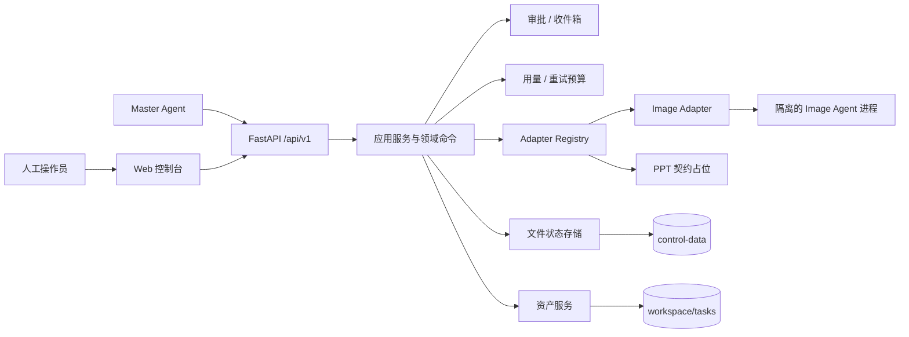

# Agentic Design Harness

[](https://github.com/HST314/agentic-design-harness/actions/workflows/quality.yml)

面向平面设计工作流的多智能体控制平面：统一编排专业 Agent，管理人工审批、隔离进程、受控资产、用量预算和可恢复状态。

> 当前版本：`0.2.0`（Phase 1）。已完成 Image Agent 的单机闭环；PPT 任务可以建模和展示，但 PPT Agent 尚未接入实际运行。当前版本适合本地开发、单用户验证与方案集成，不是多租户生产平台。

## 从这里开始

| 目标 | 推荐入口 |
| --- | --- |
| 第一次在本机启动 | [快速开始](#快速开始)，遇到问题再看[安装与启动指南](docs/getting-started.md) |
| 浏览器打不开或命令报错 | [常见问题排查](docs/troubleshooting.md) |
| 通过 API 编排任务 | [Master API 调用指南](docs/master-api-guide.md) |
| 备份、恢复、升级或回滚 | [运行手册](docs/operations.md) |
| 参与开发 | [贡献指南](CONTRIBUTING.md) |
| 查找全部文档 | [文档中心](docs/README.md) |

## 项目概览

传统的“一个 Agent 包办全部工作”很难同时保证进程隔离、人工控制、文件可信度和故障恢复。本项目把这些横切能力放进独立 Harness，让 Image、PPT 等专业 Agent 保持自治，并通过稳定契约接入。

核心能力包括：

- **任务编排**：支持 Image-only、PPT-only 和 Image → PPT 三种计划拓扑，统一管理任务、阶段和实例状态。
- **Agent 隔离**：每个运行实例使用独立进程、端口、目录、凭据和配置快照；Harness 不导入专业 Agent 的内部 Python 包。
- **人工审批**：提供固定 Owner 的审批流和 FIFO 收件箱，关键步骤可由人工或 Master Agent 接管。
- **资产可信**：输入和交付均通过受控目录流转，发布时校验 MIME、大小与 SHA-256，避免直接信任外部文件路径。
- **用量与预算**：聚合 Token、图片计费单位和费用完整性，按任务控制自动重试预算与人工越权。
- **配置与密钥**：支持全局配置、实例配置和凭据池；公开 API 只返回脱敏信息。
- **审计与恢复**：写操作带 Actor、幂等键和 revision；状态采用事件提交、原子快照和可重建索引。
- **Web 控制台**：集中查看任务、实例、审批、资源、Token/费用、事件和配置；专业创作界面通过 Agent 深链打开。

## 系统架构



后端依赖方向保持为 `API → application/domain → storage/adapters`。跨模块数据结构由 `contracts/v1` 中的 JSON Schema 固定，前端类型从这些契约生成。

## 运行要求

| 项目 | 要求 |
| --- | --- |
| 操作系统 | Windows 10/11、Windows Server 2022 或 Linux |
| Python | 3.10+；CI 在 Windows/Linux 覆盖 3.10 与 3.13 |
| Node.js | 22+ |
| 其他工具 | npm、Git；GNU Make 仅用于 Linux/macOS 快捷命令 |
| Image Agent | 仅启动真实 Image 工作流时需要；源码和依赖必须使用固定版本 |

Linux 使用 `/proc`、文件锁和 POSIX 进程组；Windows 使用 Win32 文件锁、进程组与 Job Object。两套后端提供相同的 PID 防复用、进程树终止和唯一写者语义，启动时会检测当前内核能力。macOS 尚未进入正式支持矩阵。

## 快速开始

下面的流程只启动本地控制平面，不需要先安装 Image Agent。除非某一步明确说明，**所有命令都必须在仓库根目录执行**。仓库根目录就是同时包含 `pyproject.toml`、`backend/`、`frontend/` 和 `.venv/` 的目录；在 Windows CMD 中，提示符应停在 `...\agentic-design-harness>`，不要先执行 `cd backend`。

`harness` 不是仓库根目录下的 `harness.py` 文件，而是位于 `backend/harness/` 的 Python 包，入口文件是 `backend/harness/__main__.py`。`pyproject.toml` 声明了 `backend` 源码布局，因此首次运行前必须执行下面的 `pip install --no-deps -e .`，把这个包安装到当前项目的 `.venv` 中。仅创建 `.venv` 或仅安装 `requirements-dev.txt` 都不足以运行 `python -m harness`。

### 1. 获取代码

```bash
git clone https://github.com/HST314/agentic-design-harness.git
cd agentic-design-harness
```

### 2. 创建虚拟环境并安装项目（首次必须完成）

Linux：

```bash
python3 -m venv .venv
.venv/bin/python -m pip install --require-hashes -r requirements-dev.txt
.venv/bin/python -m pip install --no-deps -e .
npm --prefix frontend ci
```

Windows CMD 或 PowerShell：

```bat
py -3 -m venv .venv
.\.venv\Scripts\python.exe -m pip install --require-hashes -r requirements-dev.txt
.\.venv\Scripts\python.exe -m pip install --no-deps -e .
npm --prefix frontend ci
```

前两条 Python 安装命令的职责不同：`requirements-dev.txt` 安装固定版本的依赖，`pip install --no-deps -e .` 安装本仓库的 `harness` 包；后者不能省略。

这里特意直接调用 `.venv` 中的 Python，不要求激活虚拟环境，因此 CMD 和 PowerShell 可以使用同一组命令，也不会误装到其他 Python 环境。提示符显示 `(.venv)` 并不能证明当前 `python.exe` 来自本项目，实际解释器路径才是判断依据。

安装后立即验证 Python 与 `harness` 的来源。

Linux：

```bash
.venv/bin/python -c "import sys, harness; print(sys.executable); print(harness.__file__)"
```

Windows CMD 或 PowerShell：

```bat
.\.venv\Scripts\python.exe -c "import sys, harness; print(sys.executable); print(harness.__file__)"
```

命令必须成功打印两行：第一行指向当前仓库的 `.venv`，第二行指向当前仓库的 `backend\harness\__init__.py`。如果不是这两个位置，不要继续启动，先按本节重新安装。需要激活方式或更完整的 Python 环境自检时，请看[安装与启动指南](docs/getting-started.md)。

### 3. 启动两个服务（每次使用）

本地 Web 控制台由两个必须同时常驻的进程组成：

| 终端 | 服务 | 端口 | 职责 |
| --- | --- | --- | --- |
| 终端一 | Python/FastAPI 后端 | `18080` | API、任务状态、审批、资产和 Agent 调度 |
| 终端二 | Node/Vite 前端 | `18180` | 浏览器界面，并把 `/api`、`/healthz`、`/readyz` 代理到后端 |

先在终端一启动后端，并保持终端开启。

Linux：

```bash
.venv/bin/python -m harness
```

Windows CMD 或 PowerShell：

```bat
.\.venv\Scripts\python.exe -m harness
```

不要进入 `backend` 后运行 `python.exe -m harness`。这种方式可能因为 Python 自动把当前目录加入模块搜索路径而“碰巧成功”，即使 `python.exe` 实际来自另一个虚拟环境；它不能证明项目已经正确安装。并且 `.venv` 位于仓库根目录，在 `backend` 中执行 `.\.venv\Scripts\python.exe` 必然找不到路径。若当前提示符已经停在 `...\agentic-design-harness\backend>`，先执行 `cd ..` 回到仓库根目录，再使用上面的显式 `.\.venv\Scripts\python.exe` 命令。

再打开终端二，进入同一个仓库根目录并启动前端：

```bash
npm --prefix frontend run dev
```

最后打开 **<http://127.0.0.1:18180/>**。不要把后端根地址 `http://127.0.0.1:18080/` 当作 Web 页面；该路径返回 `404 Not Found` 是预期行为。

| 地址 | 用途 | 正常结果 |
| --- | --- | --- |
| <http://127.0.0.1:18180/> | Web 控制台 | 显示任务与实例界面 |
| <http://127.0.0.1:18080/healthz> | 后端存活检查 | HTTP 200 |
| <http://127.0.0.1:18080/readyz> | 后端就绪检查 | HTTP 200 且状态为 `ready` |
| <http://127.0.0.1:18080/docs> | Swagger API 文档 | 显示交互式接口文档 |
| <http://127.0.0.1:18080/> | 后端未定义的根路由 | HTTP 404（正常） |

如果前端显示“服务不可达”或终端二出现 `ECONNREFUSED`，通常是终端一未运行。按[排障文档](docs/troubleshooting.md)逐项检查。

### Windows 出现 `No module named harness` 时

先回到仓库根目录。下面五项必须依次成功，不要用裸 `python.exe` 或 `pip.exe` 替换其中的显式 `.venv` 路径：

```bat
dir pyproject.toml
dir backend\harness\__main__.py
.\.venv\Scripts\python.exe -m pip install --require-hashes -r requirements-dev.txt
.\.venv\Scripts\python.exe -m pip install --no-deps -e .
.\.venv\Scripts\python.exe -c "import sys, harness; print(sys.executable); print(harness.__file__)"
```

- 第一条失败：当前不在仓库根目录；如果刚执行过 `cd backend`，先运行 `cd ..`。
- 第二条失败：仓库内容不完整或不是最新版本，先检查 `git status` 并拉取 `main`。
- 第三或第四条失败：依赖或项目本体尚未正确安装到该 `.venv`，应先处理失败命令的完整报错。
- 第五条成功且两个路径符合上一节的预期后，才执行 `.\.venv\Scripts\python.exe -m harness`。

如果 `.\.venv\Scripts\python.exe` 本身不存在，说明尚未在仓库根目录创建项目虚拟环境，请从“第 2 步”完整执行，不要借用其他项目或全局 Python 环境。

### 4. 配置后端（可选）

默认配置可以直接启动空控制平面。需要自定义数据目录、监听地址或 Image Agent 路径时：

```bash
cp config/harness.example.yaml config/harness.local.yaml
export HARNESS_CONFIG=config/harness.local.yaml
```

Windows PowerShell 使用 `Copy-Item config/harness.example.yaml config/harness.local.yaml`，再执行 `$env:HARNESS_CONFIG = "config/harness.local.yaml"`；Windows CMD 使用 `copy config\harness.example.yaml config\harness.local.yaml`，再执行 `set HARNESS_CONFIG=config\harness.local.yaml`。

常用环境变量会覆盖 YAML 中的同名配置：

| 环境变量 | 默认值 | 说明 |
| --- | --- | --- |
| `HARNESS_HOST` | `127.0.0.1` | 后端监听地址 |
| `HARNESS_PORT` | `18080` | 后端监听端口 |
| `HARNESS_CONTROL_ROOT` | `control-data` | 控制状态、事件和密钥目录 |
| `HARNESS_WORKSPACE_ROOT` | `workspace` | 任务输入与交付目录 |
| `HARNESS_IMAGE_AGENT_ROOT` | `../image_agent_mvp` | Image Agent 源码目录 |
| `HARNESS_IMAGE_AGENT_PYTHON` | 当前 Python 解释器 | Image Agent 解释器；Windows 可设为 `.venv\Scripts\python.exe` |
| `HARNESS_IMAGE_AGENT_REVISION` | 固定提交 | 允许启动的 Image Agent 版本 |

凭据不能写入 YAML 或 `.env` 后提交到 Git。请通过受控的 `/api/v1/key-pool` 接口写入，公开响应只会返回 Key ID、尾号和 Base URL 提示。

### 5. 创建第一个任务

当前 Web 控制台用于管理和观察任务，任务创建与计划提交由 Master Agent 或 API 完成。下面的请求会创建一个可在控制台中看到的空任务：

```bash
curl --request POST http://127.0.0.1:18080/api/v1/tasks \
  --header 'Content-Type: application/json' \
  --data '{
    "task_id": "task_campaign_01",
    "title": "Campaign visual",
    "goal": "Create a reviewable campaign visual.",
    "master_owner": "master_default",
    "start_policy": "manual",
    "input_manifest": "inputs/manifests/input_rev_1.json",
    "envelope": {
      "idempotency_key": "create_task_campaign_01",
      "actor_type": "master",
      "actor_id": "master_default",
      "expected_revision": 0
    }
  }'
```

完整业务顺序是：创建任务 → 导入输入 → 保存计划与任务卡 → 确认启动 → 处理审批 → 验证交付。字段定义和可直接试用的请求体均可在 Swagger UI 中查看；编排规则见 [Master API 调用指南](docs/master-api-guide.md)。

## 接入 Image Agent

真实 Image 工作流要求 Image Agent 源码位于配置指定目录，且 Git revision 与 `image_agent_revision` 完全一致。准备其隔离依赖：

```bash
make image-agent-env IMAGE_AGENT_ROOT=../image_agent_mvp
```

先运行不调用外部模型的真实进程门禁：

```bash
make g2-e2e IMAGE_AGENT_ROOT=../image_agent_mvp
make g3-e2e IMAGE_AGENT_ROOT=../image_agent_mvp
```

G3 覆盖“人工确认 → 真实 Adapter/进程 → 受控发布 → 主任务完成”。多实例、凭据轮转、配置覆盖、用量和取消链路使用：

```bash
make g4-e2e IMAGE_AGENT_ROOT=../image_agent_mvp
```

需要访问真实模型 Provider 时，请使用专用测试凭据文件，并先执行预检：

```bash
make real-provider-preflight \
  REAL_PROVIDER_ENV_FILE=/secure/provider.env

make real-provider-smoke \
  IMAGE_AGENT_ROOT=../image_agent_mvp \
  REAL_PROVIDER_ENV_FILE=/secure/provider.env
```

真实门禁会检查 Harness 与 Image Agent 的提交身份和工作树清洁度；证据不会记录 API Key、完整 Provider URL、请求正文或模型响应正文。详细变量与故障排查见 [运行手册](docs/operations.md)。

## 测试与质量门禁

测试脚本是发布能力的一部分，仓库精简不会删除它们。

| 命令 | 用途 |
| --- | --- |
| `make test` | 契约、单元、集成、崩溃恢复和可用的 E2E 测试 |
| `make check` | 测试、Ruff、compileall、密钥扫描、边界检查、前端类型检查与构建 |
| `make verify` | `check` + Pyright + Python/npm 漏洞审计 + SBOM + 容量基准 |
| `npm --prefix frontend run test:e2e` | Playwright 浏览器测试 |
| `make g5-e2e IMAGE_AGENT_ROOT=../image_agent_mvp` | Phase 1 完整离线发布门禁与证据索引 |

`make test` 在未提供合格 Image Agent 环境时会按设计跳过真实 Agent 用例；这不等同于真实链路已通过。发布前应根据目标范围执行对应的 G2–G5 门禁。

Windows 不要求安装 GNU Make。可直接使用 `.\.venv\Scripts\python.exe` 运行测试、Ruff 和 Pyright，并使用 `npm --prefix frontend run check` 检查前端；完整命令见[贡献指南](CONTRIBUTING.md#本地验证)。GitHub Actions 会在真实 `windows-latest` 内核上执行完整后端测试矩阵。

## 数据、安全与恢复

- `control-data/` 保存控制状态、事件、配置投影和受限凭据；`workspace/tasks/` 保存任务输入与交付。两者默认不会进入 Git。
- 一致备份必须同时包含上述两个目录，并在停止新写入、正常关闭 Harness 后执行。
- 不要直接修改状态文件，也不要通过重新发送 start/advance 命令修复恢复状态；启动流程会重建安全投影并对账活动实例。
- 默认服务只监听 `127.0.0.1`。当前没有登录、RBAC 或多租户隔离，不能直接暴露到公网；跨主机访问应置于受信反向代理和网络访问控制之后。
- `healthz` 只代表进程存活；只有 `readyz` 返回 `ready` 才表示契约注册与唯一写者租约均已就绪。

备份、升级、回滚和故障排查步骤见 [运行手册](docs/operations.md)。

## 项目结构

```text
backend/harness/   FastAPI、领域命令、应用服务、Adapter 与文件状态存储
frontend/          TypeScript/Vite 控制台与 Playwright 测试
contracts/v1/      JSON Schema、状态/错误目录及示例
config/            非敏感配置样例与容量 SLO
requirements/      人工维护的 Python 顶层依赖输入
scripts/           质量门禁、契约生成、SBOM、基准与浏览器集成入口
tests/             契约、单元、集成、崩溃恢复、真实进程 E2E 与测试夹具
docs/              当前仍有效的 API、运维、契约、容量与发布验收资料
```

## 关键文档

- [文档中心](docs/README.md)：按首次使用、开发、集成和运维场景查找文档。
- [安装与启动指南](docs/getting-started.md)：Linux、Windows CMD 与 PowerShell 的完整步骤。
- [常见问题排查](docs/troubleshooting.md)：404、模块缺失、前端 500、端口冲突和环境问题。
- [Master API 调用指南](docs/master-api-guide.md)：命令信封、标准流程、分页和错误处理。
- [运行手册](docs/operations.md)：安装、备份、恢复、升级、回滚和故障排查。
- [契约版本规则](docs/contract-versioning.md)：Schema 兼容边界和升级流程。
- [单机容量 SLO](docs/single-machine-capacity-slo.md)：适用边界、基准和容量纪律。
- [G5 发布验收](docs/verification/g5-release.md)：完整门禁场景和证据生成。
- [Phase 1 验收矩阵](docs/verification/phase1-traceability.md)：需求与可执行测试的映射。
- [RFC v0.2](docs/rfc-v0.2.md)：当前契约和验收证据仍依赖的 Phase 1 设计基线。

## 当前边界与路线

当前版本明确不包含：

- 可运行的 PPT Agent Adapter；
- 多用户身份、RBAC、SSO 和外部通知；
- 数据库、对象存储、多机调度和高可用；
- 以 WebSocket 为基础的实时事件推送；
- 公网部署所需的认证与网络安全层。

后续优先级是接入真实 PPT 运行时并明确 Master 运行边界，再引入身份权限和多机存储。任何扩展都应保持 Adapter 隔离、稳定契约、受控资产和可恢复写入这四个核心约束。

## 许可证

仓库当前未提供开源许可证。除非仓库所有者另行授权，否则不要假设代码可用于分发或商业用途。
