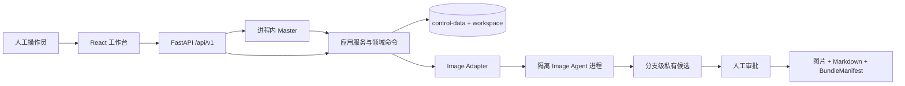

# Agentic Design Harness

[](https://github.com/HST314/agentic-design-harness/actions/workflows/quality.yml)

面向平面设计工作流的多智能体控制面。进程内 Master 统一生成和确认 TaskCard，专业 Agent 在隔离进程中执行，人工审批、预算、资产发布和故障恢复收敛到一个可审计工作台。

## 当前能力

- Master 是正式任务和 TaskCard 的唯一创建入口；人工可审阅、修订并确认准确版本后启动。
- Image Agent 由固定 Git submodule 与 release lock 锁定，运行在隔离依赖、独立进程和 loopback HTTP 边界内。
- 同一 WorkItem 的多个分支可分别形成“最终图片 + Markdown 设计说明”候选。
- 只有人工确认后的图片、说明和 BundleManifest 才会以同一 publication batch 原子发布。
- React 工作台覆盖创建任务、Master 会话、任务卡、计划、Image 工作台、审批和交付。
- 根目录 `.env` 与 `config/` 下四个 YAML 是唯一部署配置；全局设置可安全发布无秘密的 Harness 与 Image Agent 运行默认值。
- 所有写操作使用 revision、Actor 和幂等键；事件、快照、索引与发布意图支持崩溃恢复。

## 总体架构



Harness 与 Image Agent 之间只通过稳定契约、受控文件和本机 HTTP 通信；运行版本由 `agents/image-agent.lock.json` 唯一锁定。

## 成熟度与边界

| 项目 | 当前状态 |
| --- | --- |
| 当前版本 | `0.2.0` |
| 支持环境 | Windows 10/11、Windows Server 2022、Linux；Python 3.10+、Node.js 22+ |
| Image Agent | 已接入受管单机闭环；Ark 是首个承诺真实模型闭环的 Provider |
| PPT Agent | 只有契约与诚实的不可用状态，尚未接入运行时 |
| 部署模型 | 单机、单写者、文件存储、本地可信用户 |

当前没有多租户、RBAC、SSO、数据库、对象存储、多机调度或高可用能力。默认只监听 loopback；不要把控制面直接暴露到公网。

## 文档入口

| 读者目标 | 文档 |
| --- | --- |
| 第一次安装并启动 | [QUICKSTART](QUICKSTART.md) |
| 创建和交付第一个任务 | [用户指南](docs/user-guide.md) |
| 配置 Provider、模型与运行策略 | [配置指南](docs/configuration.md) |
| 理解 Image Agent 受管边界与版本锁 | [Image Agent 集成](docs/image-agent-integration.md) |
| 接入 Master 或调用控制面 API | [Master API](docs/master-api.md) |
| 开发、测试与双仓提交 | [贡献指南](CONTRIBUTING.md) |
| 备份恢复、容量、发布与回滚 | [运行手册](docs/operations.md) |
| 按错误签名排查 | [故障排查](docs/troubleshooting.md) |
| Schema、版本与生成 | [契约指南](docs/contracts.md) |

## 仓库结构

```text
agents/             固定 Image Agent submodule 与 release lock
backend/harness/    API、领域服务、Adapter、持久化与恢复
frontend/           React/TypeScript 工作台与浏览器测试
contracts/v1/       JSON Schema、Catalog 与有效业务示例
config/             Provider、模型清单、Harness 与 Image Agent 运行配置
scripts/            启动、配置检查、质量门禁与证据生成
tests/              单元、契约、集成、崩溃恢复与 E2E
docs/               面向用户、集成、运维与契约的现行文档
```

从 [QUICKSTART](QUICKSTART.md) 开始。仓库当前未提供开源许可证，未经所有者明确授权不要假设可分发或商用。
