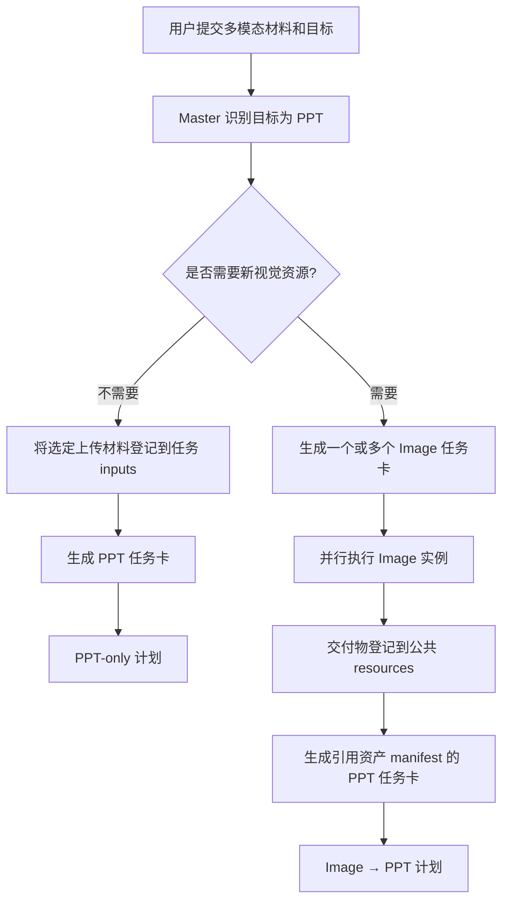
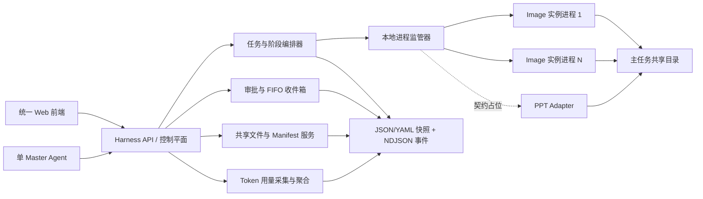

# 平面设计多智能体 Harness 技术方案（MVP RFC v0.2）

> 文档状态：Draft v0.2，待复验  
> 适用范围：`agentic-design-harness` 单机 MVP  
> 本文只定义架构、契约与实施边界，不包含本轮代码重构或 Agent 集成改动。

### 修订记录

- v0.2：依据独立验收，闭合主任务/阶段/实例状态与聚合优先级；补充可执行的自动重试次数、Token、费用预算账本与人工越权边界；将 Key/Base URL 唯一分配事件固定为“实例创建事务提交”；补齐凭据对粘滞、Image 受控发布和必需 PPT 未接入的验收门禁。
- v0.1：初版技术方案。

## 1. 摘要

本系统是一个由单个 Master Agent 与人工共同驱动的平面设计任务控制平面。它不把 Image Agent、PPT Agent 合并进同一进程，而是统一负责：

- 接收多模态任务材料；
- 由 Master 生成任务计划和任务卡；
- 创建、启动、监管相互隔离的 Agent 实例；
- 管理任务共享文件、审批、通知、Token 用量和审计；
- 通过标准适配契约接入现有或未来的专业 Agent。

MVP 的任务计划不是强制的 `Image → PPT` 流水线，而是支持三种组合：

1. `Image-only`：只生成图片或其他视觉资源；
2. `PPT-only`：直接使用用户上传的多模态材料制作 PPT；
3. `Image → PPT`：先用一个或多个 Image Agent 并行生成视觉资源，再由 PPT Agent 汇总。

PPT 是一种可选阶段类型，不被硬编码为“第二阶段”。第一期真正接入 Image Agent；PPT Agent 仅实现契约、计划位置和前端占位，不作为一期运行闭环的验收项。

## 2. 已确认的产品决策

| 主题 | MVP 决策 |
| --- | --- |
| Master | 系统只有一个 Master；每个主任务也只有一个编排 Owner |
| 任务模型 | 支持 Image-only、PPT-only、Image→PPT；阶段按任务需要组合 |
| Image 并行 | 一个 Image 工程对应一个独立业务实例和独立 OS 进程 |
| 实例隔离 | 每实例独立工作区、端口、运行参数快照和完整凭据对分配 |
| 部署 | 单机部署，由 Harness 直接拉起和监管子进程 |
| 生命周期 | 活跃实例进程保持运行；取消立即终止；完成后可保留到归档，归档时退出 |
| 参数 | 全局参数修改强制覆盖所有实例的运行参数；实例仍可在下一次全局修改前单独调整 |
| Key | 有序凭据池；在实例创建事务提交时按提交顺序轮询分配完整 `Key + Base URL` 对，实例全生命周期粘滞 |
| 启动权限 | 每个主任务可选自动启动或人工确认，默认人工确认 |
| 并发 | MVP 不设置 Harness 人为并发上限或调度队列，满足条件后立即尝试启动 |
| 审批 | 每实例一个“人工 / Master”总开关；切换只影响之后产生的审批 |
| 审批队列 | 收件箱按产生时间形成 FIFO 队列；历史审批保持创建时的 Owner |
| 共享文件 | 每个主任务一个共享根目录，内部划分输入、公共交付和实例私有区 |
| 前端文件 | 主任务页面可浏览、预览和下载共享目录中的资源 |
| Token | Harness 独立采集标准化用量事件，展示任务和实例级 Token 可视化 |
| 持久化 | JSON/YAML 快照 + NDJSON 事件日志，不使用数据库 |
| 失败决策 | Master 可重试、改卡重跑、替换实例、标记可选、降级、继续或取消 |
| 高风险动作 | 超自动重试次数、Token/费用预算和删除交付物等动作仍需人工确认 |
| 用户范围 | 单工作区、单操作人；暂不做多租户和 RBAC |
| 通知 | 仅做 Harness 内部收件箱，不接企业 IM 和邮件 |
| 一期集成 | 完成 Image Agent 闭环；PPT 只保留契约、计划节点和未接入状态 |

## 3. 目标与非目标

### 3.1 MVP 目标

- 一个主任务可包含多个并行 Image 实例，并从统一面板查看和独立控制。
- 每个实例是现有 Image Agent 工程的独立例化，不共享进程内状态或工作目录。
- Master 和人工都只能通过 Harness 命令接口改变控制平面状态。
- 支持用户上传图片及逐图说明；Master 可直接将这些材料作为 PPT 输入，或先选择生成新视觉资源。
- 共享文件、审批、通知、Token 用量和进程状态均可从统一前端查看。
- 单机重启后可以根据磁盘快照恢复主任务、实例、审批、通知、配置和用量数据。
- 子进程崩溃时保留工程数据；恢复后不静默重复已经发出的模型请求。
- 自动重试必须同时通过次数与 Token 预算闸门；启用可核验价格表时还必须通过费用闸门。

### 3.2 MVP 非目标

- 不重做 Image Agent 和 PPT Agent 的领域工作流前端。
- 不把两个 Agent 安装到同一个 Python 环境或合并成同一个进程。
- 不实现多机、Kubernetes、容器编排、分布式锁、消息队列或数据库。
- 不实现智能 Key 健康度、额度感知、自动故障转移或供应商限流调度。
- 不实现多用户、企业权限、租户隔离、邮件或 IM 通知。
- 不承诺一期实际启动 PPT Agent；PPT-only 和 Image→PPT 在一期只可被正确建模和展示。
- 不实现通用 DAG 编辑器；MVP 使用简单的有序阶段列表和显式依赖。

## 4. 核心业务流程

### 4.1 Master 接收多模态材料

当用户明确要求制作 PPT，且已经上传图片、文档及对应文字说明时，Master 应先确认是否需要在线创作新的视觉资源：



Master 不应把未经登记的绝对路径直接写进任务卡。上传材料通过 Harness 的资产导入接口进入任务目录，同时生成来源、说明、MIME、大小和 SHA-256 等元数据。

### 4.2 三种任务组合

#### Image-only

- 一个 `image` 阶段；
- 阶段内可有 1..N 个独立 Image 实例；
- 所有必需实例交付后，主任务可完成；
- 某实例可由 Master 标记为可选，之后不阻塞主任务完成。

#### PPT-only

- 一个 `ppt` 阶段，它是第一个也是唯一阶段；
- PPT 任务卡直接引用用户上传或 Master 整理后的资产 manifest；
- 一期显示为 `UNAVAILABLE` / “PPT Agent 尚未接入”，不可伪装成已运行或已完成；
- PPT Adapter 接入后，无需改变任务计划或资产契约即可执行。

#### Image → PPT

- 第一个阶段包含一个或多个并行 Image 实例；
- PPT 阶段依赖所有“必需”的 Image 实例完成；
- Image 阶段完成时显示“视觉资产已就绪”；
- 一期 PPT 占位不影响 Image 闭环的版本验收，但若该 PPT 阶段在具体任务中被标记为必需，主任务本身不能被错误标成已完成。

### 4.3 启动策略

每个主任务保存 `start_policy`：

- `manual`：默认值。Master 生成计划和任务卡后进入 `AWAITING_START_CONFIRMATION`，人工确认后启动所有当前已就绪实例；
- `auto`：计划校验通过后立即启动所有当前已就绪实例。

无论采用哪种策略，Harness 都必须先完成任务卡校验、目录创建、配置快照、预算预检和审计记录，再拉起子进程。完整凭据对已经在实例创建事务提交时分配；启动只读取该粘滞分配，不再推进轮询游标。

## 5. 总体架构



### 5.1 控制平面模块

1. **Task Service**：管理主任务、阶段、依赖和完成条件。
2. **Instance Service**：管理 Agent 实例的业务状态、任务卡、配置版本和 Key 引用。
3. **Process Supervisor**：分配端口、启动/停止独立进程、健康检查和崩溃恢复。
4. **Agent Adapter Registry**：屏蔽不同 Agent 的启动命令、状态读取、交付物和前端地址差异。
5. **Asset Service**：导入上传材料、生成 manifest、校验路径和维护共享资源索引。
6. **Approval Service**：创建审批请求、固定审批 Owner、执行合法状态转换。
7. **Inbox Service**：将审批、完成、失败、崩溃等事件变成 FIFO 通知。
8. **Usage Service**：接收标准化 Token 事件并按任务、实例、模型和时间聚合。
9. **Config & Key Pool Service**：全局配置强制下发、实例局部修改和简单轮询分配 Key。
10. **File State Store**：唯一控制面写入者，负责原子快照、事件追加和启动恢复。

### 5.2 Agent Adapter 接口

每种子 Agent 通过适配器接入，最小接口如下：

```text
validate_task_card(card) -> ValidationResult
prepare(instance, task_dir, config_ref, secret_ref) -> RuntimeSpec
start(runtime_spec) -> ProcessHandle
stop(instance_id, reason) -> StopResult
health(instance_id) -> HealthSnapshot
apply_config(instance_id, config_snapshot) -> ApplyResult
read_status(instance_id) -> AgentStatus
collect_deliveries(instance_id) -> list[AssetManifest]
collect_usage(instance_id, cursor) -> list[TokenUsageEvent]
get_ui_url(instance_id) -> URL | null
recover(instance_snapshot) -> RecoveryResult
```

一期提供可运行的 `ImageAgentAdapter` 和不可运行的 `PptAgentContractAdapter`。未来的技术方案 Agent、报价预测 Agent 等复用同一注册机制，不进入 Harness 核心代码分支判断。

## 6. 领域模型

### 6.1 MainTask

主任务是用户目标的根对象：

```json
{
  "schema_version": "1.0",
  "task_id": "t_01",
  "title": "三面文化墙及汇报材料",
  "goal": "...",
  "master_owner": "master_default",
  "start_policy": "manual",
  "status": "AWAITING_START_CONFIRMATION",
  "created_at": "RFC3339",
  "updated_at": "RFC3339",
  "input_manifest": "manifests/input.json",
  "plan_revision": 1
}
```

### 6.2 Stage

阶段具有位置，但不对 PPT 的位置做硬编码：

```json
{
  "stage_id": "s_ppt",
  "task_id": "t_01",
  "type": "ppt",
  "position": 2,
  "depends_on": ["s_image"],
  "required": true,
  "status": "UNAVAILABLE",
  "instance_ids": ["i_ppt1"]
}
```

MVP 校验规则：

- `position` 在同一计划中唯一并递增；
- `depends_on` 只能引用本任务中更早的阶段；
- Image-only 可只有 `image`；PPT-only 可只有 `ppt`；Image→PPT 的 `ppt` 依赖 `image`；
- 一个阶段可以包含多个实例；实例之间默认可并行；
- 一期允许保存和展示包含 PPT 的合法计划。激活计划时，若当前就绪的必需 PPT 实例不可执行，则实例/阶段进入 `UNAVAILABLE`，主任务按 §7 聚合为 `BLOCKED_UNAVAILABLE`，命令返回明确的 `ADAPTER_UNAVAILABLE`；不得用一次性“运行前校验失败”替代持久状态。

### 6.3 AgentInstance

```json
{
  "instance_id": "i_img1",
  "task_id": "t_01",
  "stage_id": "s_image",
  "agent_type": "image",
  "required": true,
  "status": "READY",
  "approval_mode": "human",
  "config_revision": 7,
  "credential_pair_ref": "cred_01",
  "credential_pair_revision": 3,
  "workspace_relpath": "instances/i_img1",
  "task_card_relpath": "instances/i_img1/task-card.json",
  "ui_url": null,
  "process": null,
  "created_at": "RFC3339"
}
```

`credential_pair_ref` 引用不可拆分的 Key/Base URL 凭据对，`credential_pair_revision` 固定其分配时版本；API Key 明文不能出现在实例快照、任务卡、共享目录、日志和前端响应中。Base URL 可以在受控诊断页脱敏展示，但不能脱离对应的凭据对单独改配。

### 6.4 AssetManifest

```json
{
  "schema_version": "1.0",
  "asset_id": "a_01",
  "task_id": "t_01",
  "producer_instance_id": null,
  "kind": "image",
  "role": "user_reference",
  "relative_path": "inputs/original/a_01/reference.png",
  "mime_type": "image/png",
  "size_bytes": 123456,
  "sha256": "...",
  "description": "用户说明：作为品牌视觉参考",
  "created_at": "RFC3339"
}
```

跨 Agent 契约只传 `task_id`、`asset_id`、相对路径和 manifest，不传宿主机绝对路径。

Image 交付发布后的 manifest 必须将 `producer_instance_id` 设为来源实例，并额外记录 `source_relative_path`（候选输出位置）、`publication_id` 和 `published_at`。`mime_type`、`size_bytes` 与 `sha256` 必须由 Asset Service 对公共资源区中的最终文件重新计算，不能信任 Agent 自报值。

### 6.5 ApprovalRequest

```json
{
  "approval_id": "ap_01",
  "task_id": "t_01",
  "instance_id": "i_img1",
  "step_id": "style_confirm",
  "owner": "human",
  "status": "PENDING",
  "payload_ref": "approvals/ap_01/request.json",
  "created_at": "RFC3339",
  "sequence": 18
}
```

审批在创建时复制实例当前的 `approval_mode` 到 `owner`。之后切换实例总开关，不迁移已有审批；只影响新审批。

### 6.6 TokenUsageEvent

Token 采集是控制平面的横切能力，不绑定某个子 Agent 的内部实现：

```json
{
  "schema_version": "1.0",
  "event_id": "usage_01",
  "task_id": "t_01",
  "instance_id": "i_img1",
  "agent_type": "image",
  "request_id": "provider_request_or_local_id",
  "model": "model-name",
  "credential_pair_ref": "cred_01",
  "input_tokens": 1200,
  "output_tokens": 300,
  "cached_input_tokens": 0,
  "reasoning_tokens": 0,
  "total_tokens": 1500,
  "occurred_at": "RFC3339"
}
```

可选字段可增加费用估算，但 Token 数据是一期必需字段。Agent 暂时无法上报时显示“未上报”，不能显示为 0。

### 6.7 RetryPolicy 与 RetryBudgetLedger

自动重试预算是主任务的持久配置和账本，而不是 Master 提示词中的约定：

```json
{
  "retry_policy": {
    "max_auto_retries_per_retry_group": 2,
    "max_auto_retry_tokens_task": 100000,
    "retry_token_reservation_by_agent": {
      "image": 20000,
      "ppt": 30000
    },
    "max_auto_retry_cost_micros": null,
    "price_catalog_revision": null
  },
  "retry_budget_ledger": {
    "auto_retries_started": 0,
    "retry_tokens_reserved": 0,
    "retry_tokens_settled": 0,
    "retry_cost_micros_settled": null,
    "revision": 1
  }
}
```

以上数字只是结构示例，不是产品默认值。规则如下：

- “重试”是同一逻辑工作的第二次及后续执行，包括同实例重启、失败后新建替代实例和自动改卡重跑；必须通过 `retry_of_attempt_id` / `retry_group_id` 串起谱系，不能靠换实例逃逸预算。
- `max_auto_retries_per_retry_group` 和 `max_auto_retry_tokens_task` 为可执行硬上限；替代实例沿用原 `retry_group_id` 计数。任务未显式配置、且全局配置也没有默认值时，自动重试次数默认为 `0`。
- 每次自动重试前，Harness 在同一文件锁临界区内检查次数，并按 Agent 类型预留 `retry_token_reservation`。只有满足 `已结算 Token + 已预留 Token + 本次预留量 <= Token 上限` 才能启动。
- Adapter 必须能为一次重试提供可验证的总 Token 上界；无法提供上界时不得自动重试，只能进入人工预算确认。执行结束后以标准化 usage 结算并释放未使用预留；若供应商实际值异常超过预留，记录预算超限事件并冻结后续自动重试。
- 有固定版本价格表时，费用按 `usage × price_catalog_revision` 的整数微单位计算，并与 `max_auto_retry_cost_micros` 同时校验；任一闸门失败即阻断。价格表缺失、过期或目标模型无价格时，费用显示为“未知”，绝不能按 0 元处理；此时以次数 + Token 作为可验证预算上限。若任务明确配置了费用上限但费用不可计算，则自动重试直接被阻断。
- 超限后状态不被 Master 强行改写。Harness 创建 `BUDGET_APPROVAL_REQUIRED` 审批；人工只能批准一次带明确 Token 上限（以及可计算时的费用上限）的单次越权，或修订任务预算。批准记录与预算 revision 均进入审计。

## 7. 状态机

### 7.1 主任务状态

主任务唯一合法状态集合为：

```text
DRAFT | PLANNED | AWAITING_START_CONFIRMATION | RUNNING |
WAITING_APPROVAL | BLOCKED_UNAVAILABLE | FAILED |
SUCCEEDED | PARTIAL | CANCELLED
```

允许的状态转换为：

```text
DRAFT -> PLANNED | CANCELLED
PLANNED -> AWAITING_START_CONFIRMATION | RUNNING | BLOCKED_UNAVAILABLE | CANCELLED
AWAITING_START_CONFIRMATION -> RUNNING | BLOCKED_UNAVAILABLE | CANCELLED
RUNNING -> WAITING_APPROVAL | BLOCKED_UNAVAILABLE | FAILED | SUCCEEDED | PARTIAL | CANCELLED
WAITING_APPROVAL -> RUNNING | BLOCKED_UNAVAILABLE | FAILED | SUCCEEDED | PARTIAL | CANCELLED
BLOCKED_UNAVAILABLE -> PLANNED | RUNNING | PARTIAL | CANCELLED
FAILED -> PLANNED | RUNNING | PARTIAL | CANCELLED
SUCCEEDED | PARTIAL | CANCELLED -> （无后续业务转换）
```

- `BLOCKED_UNAVAILABLE` 是持久的主任务状态，不是错误消息别名。保存含 PPT 的计划仍然成功：PPT-only 在自动激活时、人工计划在确认启动时进入该状态；Image→PPT 先执行 Image，待视觉资产就绪且下一个必需 PPT 不可执行时再进入该状态。
- `FAILED` 表示存在未解决的必需失败且当前没有仍能推进的工作；它允许在合法重试、替换或计划修订后回到 `RUNNING` / `PLANNED`，因此不是不可恢复的删除态。
- `SUCCEEDED`：所有当前必需阶段均为 `SUCCEEDED`，不存在未解决的原必需项降级、活动实例、待审批或必需 `UNAVAILABLE`。
- `PARTIAL`：至少一个已经激活过的必需实例/阶段经授权降级为 optional / skipped，且其余必需项全部成功、没有活动实例。单纯含有从一开始就是 optional 的未接入 PPT 不构成 `PARTIAL`。
- `CANCELLED`、`SUCCEEDED`、`PARTIAL` 是主任务终态。

主任务状态由子状态按以下固定优先级聚合；除取消和人工启动确认外，不允许调用方自行指定聚合结果：

1. 已持久化的主任务终态保持不变；尚未激活的人工任务保持 `AWAITING_START_CONFIRMATION`。
2. 只要任一未跳过实例仍处于 `READY / STARTING / RUNNING`，或必需阶段仍在等待正在运行的前置阶段，主任务为 `RUNNING`。
3. 没有上述活动工作，且至少一个必需实例处于 `WAITING_APPROVAL`（含预算审批）时，主任务为 `WAITING_APPROVAL`。
4. 没有活动工作和待审批，且存在未解决的必需 `FAILED_TO_START / FAILED / CRASHED` 时，主任务为 `FAILED`。
5. 没有活动工作、待审批和必需失败，且当前可推进的必需阶段/实例为 `UNAVAILABLE` 时，主任务为 `BLOCKED_UNAVAILABLE`。
6. 其余情况才计算 `SUCCEEDED` 或 `PARTIAL` 的完成条件。

因此，并行实例 A 等待审批、实例 B 仍运行时，主任务保持 `RUNNING`；B 结束且无其他活动工作后才变为 `WAITING_APPROVAL`。审批通过后统一重算：有后续工作则回到 `RUNNING`，所有完成条件满足则进入 `SUCCEEDED/PARTIAL`，后续必需 PPT 不可用则进入 `BLOCKED_UNAVAILABLE`。

### 7.2 阶段状态

```text
PENDING -> READY -> RUNNING -> WAITING_APPROVAL -> SUCCEEDED
   |         |        |               |             
   |         |        +-------------> FAILED
   |         +----------------------> UNAVAILABLE
   +--------------------------------> UNAVAILABLE
PENDING | READY | UNAVAILABLE -> SKIPPED（仅 optional 或经授权降级）
PENDING | READY | RUNNING | WAITING_APPROVAL -> CANCELLED
FAILED -> READY | RUNNING（合法重试/替换）
UNAVAILABLE -> READY（Adapter 可用）
```

阶段聚合遵循与主任务相同的“活动工作优先”原则：依赖未满足为 `PENDING`；依赖满足且存在可启动实例为 `READY`；任一实例正在启动/运行则为 `RUNNING`；仅在没有活动实例且存在阻塞性审批时为 `WAITING_APPROVAL`；未解决的必需实例失败时为 `FAILED`；必需 Adapter 不可用时为 `UNAVAILABLE`；所有必需实例成功且无活动实例时才为 `SUCCEEDED`。`SKIPPED` 与 `CANCELLED` 为阶段终态。

### 7.3 实例状态

```text
CREATED -> READY | UNAVAILABLE
UNAVAILABLE -> READY | CANCELLED | ARCHIVED
READY -> STARTING | CANCELLED
STARTING -> RUNNING | FAILED_TO_START | CRASHED | CANCELLED
RUNNING -> WAITING_APPROVAL | SUCCEEDED | FAILED | CRASHED | CANCELLED
WAITING_APPROVAL -> RUNNING | SUCCEEDED | FAILED | CANCELLED
FAILED_TO_START | FAILED | CRASHED -> READY | STARTING | SUPERSEDED | CANCELLED | ARCHIVED
SUCCEEDED | CANCELLED | SUPERSEDED -> ARCHIVED
ARCHIVED -> （无后续转换）
```

业务实例和 OS 进程是两个概念。PID 丢失不代表业务实例丢失；业务快照和工作目录始终保留。`RESTART_REQUIRED` 是实例快照上的配置应用标志，不占用业务状态；`INTERRUPTED` 是单次模型调用/运行尝试的结果，也不是实例状态。所有未列出的跳转必须被 Harness 拒绝并审计。

## 8. 单机进程模型

### 8.1 一实例一进程

每个 Image 工程启动独立进程，并拥有：

- 独立工作目录；
- 独立监听端口；
- 独立任务卡；
- 独立有效配置快照；
- 固定的 Key/Base URL 凭据对引用；
- 独立 stdout/stderr 日志；
- 独立状态、审批和 Token 统计。

进程间不共享 Python 内存、线程池、文件锁或 Agent 运行时对象。Harness 不在同一 Python 环境中导入并执行两个 Agent 的内部模块，而是通过进程和适配器边界调用。

### 8.2 启动顺序

实例在进入本启动流程前，已经按 §9.2 于“实例创建事务提交”时持久化 `credential_pair_ref`；启动不参与轮询。启动顺序为：

1. 验证阶段已就绪、启动策略已满足；
2. 验证实例目录、初始快照、任务卡与凭据对引用完整；
3. 若本次是自动重试，原子执行次数、Token 和可选费用预算预检与预留；
4. 写入当前有效配置快照和本次 `attempt_id / launch_id`；
5. 从同一个 `credential_pair_ref + revision` 解析并通过环境变量注入 API Key 与 Base URL；禁止分别查找或分别覆盖；
6. 分配端口并启动子进程；
7. 健康检查通过后置为 `RUNNING`；
8. 将可访问的现有 Agent 前端地址写入 `ui_url`。

### 8.3 无人为并发上限

MVP 对就绪实例立即调用进程启动，不设置 Harness 层进程上限、Key 并发上限或排队调度。该决策不代表机器和供应商 API 没有物理限制：

- OS 无法创建进程、端口不足或内存不足时，实例进入 `FAILED_TO_START`；
- API 限流由子 Agent 返回并进入失败处理流程；自动重试仍须通过 §6.7 的预算闸门；
- 所有失败在任务面板和收件箱可见；
- 后续版本再增加资源上限、Key 健康度和调度队列。

### 8.4 崩溃与恢复

- Harness 启动时扫描所有非终态实例，核对 PID、进程启动标识和端口健康状态；
- stale PID 不能被当成仍存活的 Agent；
- 子进程崩溃后实例置为 `CRASHED`，保留目录、Key 和配置引用并产生收件箱事件；
- 恢复时重新拉起同一个业务实例，不新建第二份工程；
- 崩溃时正在进行的模型调用标记为 `INTERRUPTED`，由 Master 或人工决定重试，不能静默重放；
- 所有重试带幂等键，并同时受 §6.7 的次数、Token 与可用时的费用上限约束；任一闸门不通过都创建预算审批，不能由 Master 绕过。

### 8.5 完成、取消与归档

- 完成：实例置为 `SUCCEEDED`，交付 manifest 固化；为复用现有详情页面，进程可保留到归档；
- 取消：先终止该实例进程，再置为 `CANCELLED`；目录和审计记录保留；
- 归档：停止仍存活的进程，释放端口，实例只读；
- MVP 不提供物理删除交付目录的普通操作。

## 9. 全局配置与实例配置

### 9.1 配置语义

1. 新实例从当前全局配置复制一份完整快照；
2. 实例内修改只影响该实例；
3. 每次全局配置保存时，将新的完整全局配置强制复制到所有未归档实例，覆盖此前的实例修改；
4. 覆盖后实例的 `config_revision` 更新，生成审计事件；
5. 已经发出的模型请求不可能被中途改写，新配置从下一次模型调用或下一个安全步骤生效；
6. 若 Agent 不支持热加载，适配器将实例的 `restart_required` 标志置为 `true`，并在安全点受控重启；业务状态仍按 §7.3 保持；
7. 运行中实例固定 Agent 代码版本，代码升级不做热更新，需明确重启或新建实例。

这套规则保留了“实例可临时独立调参”，同时严格执行用户选择的“下一次全局修改覆盖所有实例”。

### 9.2 Key 池

Key 池是一个有序的“凭据对”列表。Key 与 Base URL 是同一分配单元，任何接口都不能拆开轮询、拼接或单独回退：

```yaml
- credential_pair_id: cred_01
  key_id: key_01
  base_url: https://provider-a.example/v1
  api_key: "***"
  enabled: true
  revision: 3
```

唯一分配事件是 **AgentInstance 创建事务成功提交**，不是计划保存、启动、首次模型调用或进程重启。轮询算法在 Key 池文件锁内执行：

```text
enabled_pairs = 按配置顺序过滤 enabled=true
selected = enabled_pairs[next_cursor % len(enabled_pairs)]
将 selected.credential_pair_id + selected.revision 写入待创建实例
持久化 INSTANCE_CREATED 与 CREDENTIAL_PAIR_ASSIGNED 事件
next_cursor = next_cursor + 1
原子提交实例创建记录、分配记录与新 cursor
```

- 分配顺序以锁内事务提交顺序为准，与人工点击启动的时间无关。只有一对时所有实例使用该对；三对时，依次成功创建的 `i_img1 / i_img2 / i_ppt1` 分别获得 `cred_01 / cred_02 / cred_03`，下一实例回到 `cred_01`。
- 事务在 `INSTANCE_CREATED` 持久化前整体失败/回滚时不消耗游标；一旦实例创建成功，分配即不可回滚。之后启动前取消、从未启动、启动失败、进程崩溃以及一期不可启动的 PPT 占位都已经消耗该游标位置。
- 同一实例的启动、停止、崩溃恢复、Harness 重启和归档前重启均保持原 `credential_pair_ref + revision`，不再次轮询。新建替代实例是新创建事务，会正常消耗下一个位置。
- 禁用或编辑池项目只影响后续创建；已分配实例继续使用固定 revision，直至人工执行显式 `reassign-credential-pair`。人工重分配必须选择一个完整凭据对并产生新 revision，不允许只换 Key 或只换 Base URL；显式指定重分配不推进自然轮询游标。
- 多个并发创建请求由文件锁串行化极短临界区。恢复时以不可重复的 `instance_id` 和分配事件去重，防止崩溃后同一创建请求二次推进游标。
- 启动时必须从同一凭据对 revision 读取 Key 和 Base URL；任一字段缺失、revision 不存在或配对摘要不一致时进入 `FAILED_TO_START`，不得退回全局默认 Base URL。
- MVP 不检测额度、并发、凭据健康度，也不自动故障转移；日志、事件、任务卡和前端只显示 `credential_pair_id`、`key_id` 与脱敏尾号，不返回明文 Key。

密钥文件位于控制平面专用目录，权限设为仅宿主机运行用户可读写，不位于任何主任务共享目录，也不纳入版本控制。后续再迁移到系统 Keyring 或 KMS。

## 10. 共享目录与资产协议

### 10.1 目录布局

```text
workspace/tasks/<task_id>/
├── inputs/
│   ├── original/                 # 用户原始上传，只读
│   └── selected/                 # Master 选入任务的材料
├── resources/
│   ├── shared/                   # 已登记的公共交付物
│   └── manifests/                # 资产清单
├── instances/
│   ├── <instance_id>/
│   │   ├── task-card.json
│   │   ├── runtime-config.json
│   │   ├── work/                 # 仅该实例写
│   │   ├── outputs/              # 该实例候选输出
│   │   └── logs/
├── approvals/
└── task-summary.json
```

控制面状态快照、Key 池和内部事件索引放在独立的 `control-data/` 根目录，不暴露为任务资源。

### 10.2 权限与写入规则

- 所有 Agent 可读 `inputs/selected` 和已发布的 `resources/shared`；
- 每个 Agent 只能写自己的 `instances/<instance_id>/work|outputs|logs`；
- 交付公共资源必须调用 Asset Service，由其校验并复制/移动到 `resources/shared`、计算摘要和写 manifest；
- 输入区不能被子 Agent 覆盖；
- 相对路径规范化后必须仍位于任务根目录内；拒绝 `..`、绝对路径和越界符号链接；
- 单机同用户进程下的强隔离主要依赖启动目录和 Harness 校验，MVP 不把它描述为容器级安全沙箱。

Image 输出进入公共资源区必须走以下受控发布闭环，不能靠预置文件或直接复制后补记录来冒充交付：

1. Image Agent 只把候选文件写入自己的 `instances/<instance_id>/outputs`，提交包含相对路径和交付角色的发布请求及幂等键；
2. Asset Service 验证实例归属、路径边界、普通文件类型、大小与允许 MIME，并从文件内容识别 MIME；
3. Asset Service 流式计算 SHA-256，将文件以临时名复制到 `resources/shared/<asset_id>/`，`fsync` 后原子 rename；
4. Asset Service 对公共区最终文件重新读取大小、MIME、SHA-256，生成含 `asset_id / producer_instance_id / source_relative_path / relative_path / mime_type / size_bytes / sha256 / publication_id / published_at` 的 manifest；
5. manifest 原子落盘并追加 `ASSET_PUBLISHED` 事件后，资产才可见、才可被阶段完成条件计入；同一幂等键重复请求返回同一 `asset_id`；
6. 后续阶段只能按 `asset_id + manifest` 引用该公共资产。删除或替换候选输出不影响已发布副本；公共资产的删除/替换属于人工确认的高风险动作。

若文件复制成功但 manifest 未提交，恢复程序将其视为不可见临时文件并清理/续提交；若 manifest 存在而最终文件摘要不匹配，资产标记为 `CORRUPTED`，撤销其可引用性并产生告警，不能让下游继续。

### 10.3 前端资源浏览器

主任务详情页增加“资源”页签，提供：

- 按输入、公共交付、实例输出分组的目录树；
- 图片缩略图和大图预览；
- JSON、Markdown、纯文本的安全只读预览；
- 文件名、说明、来源实例、MIME、大小、SHA-256 和创建时间；
- 单文件下载；
- 从实例输出发布到公共资源区的受控操作；
- 文件更新后的自动刷新或手动刷新。

MVP 不提供任意路径浏览、在线编辑和物理删除。未知或危险类型仅允许下载，并使用附件响应头，不能在站内执行。

## 11. 文件化持久化

### 11.1 存储策略

```text
control-data/
├── config/
│   ├── global.yaml
│   └── key-pool-state.json       # 游标、creation_id 与凭据对分配引用，不含明文 Key
├── secrets/
│   └── key-pool.yaml             # 完整 Key/Base URL 凭据对，0600，不进入共享目录/版本控制
├── tasks/<task_id>/
│   ├── task.json
│   ├── plan.json
│   ├── instances/<id>.json
│   ├── approvals/<id>.json
│   ├── inbox/<id>.json
│   ├── retry-budget.json
│   ├── usage.ndjson
│   └── events.ndjson
└── indexes/
    ├── task-index.json
    └── inbox-index.json
```

- 可变对象使用 JSON 快照；人工维护的全局配置使用 YAML；
- 状态变化先追加事件，再通过“临时文件 + fsync + 原子 rename”更新快照；
- 单个 Harness 控制面进程是唯一状态写入者；
- Key 游标、启动恢复等极小临界区使用文件锁；
- 实例创建与凭据分配使用带 `creation_id` 的意图日志：`CREDENTIAL_PAIR_ASSIGNED` 是提交点并包含初始实例摘要。提交点前失败不推进游标；提交点后崩溃由恢复程序完成实例快照，不能回滚或再次分配；
- 自动重试预算的“校验 + 预留 + attempt 记录”在任务级文件锁内作为一个原子快照更新完成，避免并发重试共同穿透预算；
- 索引可以由任务快照和事件日志重建，不是事实源；
- NDJSON 尾部损坏时截断到最后一条完整记录并产生恢复告警；
- 定期压缩历史事件只作为后续优化，一期保留完整审计。

文件化方案只面向单机单控制面。若未来需要多副本，必须迁移到数据库、持久队列和对象存储，不能在共享文件上叠加分布式写入。

## 12. 审批与 FIFO 收件箱

### 12.1 审批总开关

每个实例具有 `approval_mode = human | master`：

- `human`：之后产生的审批进入人工队列；
- `master`：之后产生的审批进入 Master 队列；
- 模式切换不改变任何已存在的 `PENDING` 审批；
- 一期不做单个审批点“临时交给 Master”按钮，该能力留待后续。

### 12.2 队列规则

- 每条审批创建时获得单调递增 `sequence`；
- 默认按 `(created_at ASC, sequence ASC, approval_id ASC)` 展示和投递；
- Master 自动消费自己的审批时严格按 FIFO 取下一条；
- 人工页面默认旧任务在前，但允许查看具体实例，不要求前一条处理完成后才能查看后一条；
- 决议通过 Harness 提交，携带审批版本和幂等键，重复提交只生效一次；
- 审批记录保存请求、Owner、决议、Actor、时间和关联步骤。

### 12.3 通知类型

- `APPROVAL_REQUIRED`
- `INSTANCE_SUCCEEDED`
- `INSTANCE_FAILED`
- `PROCESS_CRASHED`
- `BUDGET_APPROVAL_REQUIRED`
- `STAGE_READY`
- `TASK_SUCCEEDED`
- `CONFIG_RESTART_REQUIRED`

通知包含深链 `task_id / instance_id / step_id / approval_id`，支持未读、已读和已处理状态。通知与审批是不同对象：通知可以已读，但审批仍可能待处理。

## 13. Token 用量采集与可视化

### 13.1 采集

- Agent Adapter 将各供应商响应中的 usage 映射成统一 `TokenUsageEvent`；
- Master 若能提供 usage，也按一个特殊的 `master` 实例上报，纳入主任务总量；
- `event_id` 或 `(instance_id, request_id, model)` 用于幂等去重；
- 原始事件追加到任务 `usage.ndjson`，聚合结果可随时重建；
- Token 不等于费用；费用只有在命中固定 `price_catalog_revision` 时才计算。缺少价格时显示“未知”，预算闸门按 §6.7 使用次数与 Token，不能猜测成本或按零费用放行。

### 13.2 前端

主任务 Token 页面包含：

1. 总输入、总输出、缓存、推理和总 Token 卡片；
2. 每实例用量表，展示 Agent 类型、模型、Key ID、调用次数和总 Token；
3. 按时间的 Token 折线/柱状图；
4. 按实例和模型的堆叠占比图；
5. 点击实例进入详情，查看单次调用列表；
6. 明确区分“0 Token”和“Agent 未上报”。

一期采用轮询刷新即可，不要求 WebSocket。用量接口与子 Agent 业务接口解耦，未来更换 Agent 不重做页面。

## 14. API 边界（建议）

### 14.1 主任务与计划

```text
POST   /api/v1/tasks
GET    /api/v1/tasks
GET    /api/v1/tasks/{task_id}
PUT    /api/v1/tasks/{task_id}/plan
POST   /api/v1/tasks/{task_id}/confirm-start
POST   /api/v1/tasks/{task_id}/cancel
GET    /api/v1/tasks/{task_id}/retry-budget
PUT    /api/v1/tasks/{task_id}/retry-budget      # 人工修订预算
```

### 14.2 实例

```text
POST   /api/v1/tasks/{task_id}/instances
GET    /api/v1/instances/{instance_id}
POST   /api/v1/instances/{instance_id}/start
POST   /api/v1/instances/{instance_id}/restart
POST   /api/v1/instances/{instance_id}/cancel
POST   /api/v1/instances/{instance_id}/archive
PUT    /api/v1/instances/{instance_id}/config
GET    /api/v1/instances/{instance_id}/ui-link
```

### 14.3 文件与资产

```text
POST   /api/v1/tasks/{task_id}/assets/import
GET    /api/v1/tasks/{task_id}/files
GET    /api/v1/tasks/{task_id}/files/preview?path=...
GET    /api/v1/tasks/{task_id}/files/download?path=...
POST   /api/v1/instances/{instance_id}/deliveries
```

### 14.4 审批、收件箱与用量

```text
GET    /api/v1/inbox?owner=human|master&status=pending
GET    /api/v1/approvals/{approval_id}
POST   /api/v1/approvals/{approval_id}/resolve
GET    /api/v1/tasks/{task_id}/usage
GET    /api/v1/instances/{instance_id}/usage
POST   /api/v1/internal/instances/{instance_id}/usage-events
```

### 14.5 配置与 Key 池

```text
GET    /api/v1/config/global
PUT    /api/v1/config/global
GET    /api/v1/key-pool                 # 仅脱敏的完整凭据对信息
PUT    /api/v1/key-pool                 # Key/Base URL 成对写入，不回显明文
POST   /api/v1/instances/{id}/reassign-credential-pair
```

所有产生副作用的请求包含 `idempotency_key`、`actor_type`、`actor_id` 和 `expected_revision`。Master 不能直接编辑磁盘状态文件来绕过合法状态转换。

## 15. 前端信息架构

### 15.1 任务面板

每张主任务卡展示：

- 目标、当前状态、启动策略和阶段进度；
- Image/PPT 阶段及每阶段实例数；
- 运行中、待审批、失败、完成实例数量；
- 总 Token 和最新通知；
- `PPT 未接入` 等明确能力提示。

### 15.2 主任务详情

页签建议：

1. **概览**：阶段列表、依赖、Master 决策和启动确认；
2. **实例**：全部实例卡片和独立操作；
3. **资源**：共享目录浏览器；
4. **审批**：本任务审批历史；
5. **Token**：任务和实例用量图表；
6. **事件**：只读审计时间线。

### 15.3 实例详情

- Harness 统一展示实例状态、进程、配置版本、脱敏 Key、Token 和通知；
- “打开工作台”通过适配器深链到该实例现有 Image Agent 前端；
- 不在一期复制现有 Agent 的全部工作流 UI；
- 子进程不可用时仍可从 Harness 查看已保存的状态、日志摘要和资源。

## 16. 失败处理、幂等与权限边界

Master 允许执行：

- 按同一任务卡重试；
- 修改任务卡并产生新 revision 后重跑；
- 新建替代实例并将旧实例标记为 superseded；
- 将失败实例或阶段从 required 改为 optional；
- 降级继续、跳过可选节点或取消任务。

Harness 必须拒绝：

- 非法状态跳转；
- 重复幂等键造成的二次启动或二次审批；
- 超过自动重试次数上限，或下一次预留会穿透任务 Token 上限的自动执行；
- 配置了费用上限但价格未知/过期，或可计算费用将超限的自动执行；
- 未经人工一次性授权或预算 revision 修订的超预算执行；
- Master 直接删除已发布交付物或审计记录；
- 通过绝对路径、路径穿越或符号链接访问其他任务。

每个命令先写事件，再更新快照。子进程启动使用稳定的 `launch_id`；同一 `launch_id` 重复提交时返回已有进程结果，而不是再启动一个进程。

预算拒绝返回结构化的 `BUDGET_GATE_DENIED`，至少包含触发的闸门、已用/已预留/本次申请值、预算 revision 和对应审批 ID。Master 可以请求审批，但不能直接写账本、拆成多个替代实例或换任务卡 revision 绕过 `retry_group_id`。人工一次性越权只适用于响应中绑定的一个 `attempt_id`，使用后失效。

## 17. 安全与审计（单用户 MVP）

- 服务默认仅监听本机或受信内网，不直接暴露到公网；
- 单用户并不等于无边界：密钥保护、路径校验、日志脱敏和审计仍为必需；
- API Key 仅通过子进程环境变量或受控临时文件注入；临时文件权限为 0600 并及时清理；
- 前端永不返回完整 Key；
- 任务上传限制单文件大小、总大小、允许 MIME，并为下载设置安全响应头；
- 日志过滤 Authorization、API Key、Cookie 和常见密钥字段；
- 所有 Master/人工命令记录 Actor、命令、对象 revision、结果和时间；
- 审计日志追加写，普通 UI 不提供删除入口。

## 18. 分阶段实施路线

### Phase 0：总仓初始化与契约冻结

- 初始化默认分支和 `docs/`、`contracts/`、`backend/`、`frontend/` 目录；
- 固化 MainTask、Stage、Instance、TaskCard、Delivery、Asset、Approval、Usage 契约；
- 添加三种任务组合的契约测试；
- 建立状态码、错误码和 schema version 规则。

### Phase 1：Image 闭环（本期验收）

- 文件化 Task/Stage/Instance 状态存储；
- 单机进程监管和 Image Agent Adapter；
- 一实例一进程、独立目录/端口/参数及全生命周期粘滞的 Key/Base URL 凭据对；
- 全局配置强制下发和实例局部调参；
- 实例创建提交时的简单凭据对轮询与崩溃恢复；
- 自动/人工确认启动；
- 审批总开关、FIFO 收件箱和深链；
- 共享资源浏览器和资产 manifest；
- Token 用量采集、聚合与可视化；
- 崩溃发现、同实例恢复、幂等重试及次数/Token/可选费用预算闸门；
- PPT 契约、计划占位和 `ADAPTER_UNAVAILABLE` 表达。

### Phase 2：PPT 实际接入

- 根据届时稳定的 PPT Agent 形态实现 Adapter；
- 运行 PPT-only 和 Image→PPT；
- 将上传材料或 Image 公共交付物映射成 PPT 资源输入；
- 接入 PPT 状态、审批、交付和 Token 上报；
- 验证三种任务组合的端到端闭环。

### Phase 3：企业化增强

- PostgreSQL、持久队列、对象存储；
- 容器/多机调度和资源配额；
- Key 健康、额度、限流和故障转移；
- 多用户、RBAC、租户隔离和 SSO；
- WebSocket 实时更新、邮件/IM 通知；
- 通用 DAG、更多插件 Agent 和统一详情 UI。

## 19. Phase 1 验收标准

1. 可创建主任务并保存多模态材料及逐图说明。
2. 可由 Master 生成至少 3 张 Image 任务卡，并在人工确认或自动策略下启动。
3. 3 个 Image 工程运行在 3 个独立 OS 进程、独立端口和独立目录中，互不持有对方进程内状态。
4. 任务面板可同时看到全部实例，且可以分别打开、取消、重启和归档。
5. 准备三个可辨识的 `Key + Base URL` 凭据对并依次成功提交三个实例创建事务，实例按提交顺序获得 `1→2→3`，第四个获得 `1`；启动顺序不改变结果。验收需同时核对 `credential_pair_id / key_id / base_url / revision`，证明不存在错配。创建事务在提交点前失败不消耗游标；启动前取消、启动失败和不可运行的 PPT 占位在创建成功后仍消耗；任一实例重启或 Harness 恢复后保持原完整凭据对。
6. 实例可单独修改参数；修改全局参数后，全部未归档实例被新的全局配置强制覆盖。
7. 每个主任务具有输入区、公共资源区和实例私有区；越界路径被拒绝。
8. Image 实例在私有 `outputs` 生成候选文件后，必须调用受控发布接口；验收确认 Asset Service 在公共资源区产生真实文件和 manifest，manifest 含来源实例、来源相对路径、MIME、大小、SHA-256、发布 ID/时间，且这些值与最终文件实测一致。后续任务卡能以 `asset_id + manifest` 引用；仅预置公共文件或仅伪造 manifest 均不得通过。
9. 前端可以浏览、预览和下载当前主任务的共享资源，并看到来源与文字说明。
10. 审批按实例总开关路由；切换只影响新审批；人工和 Master 收件箱按时间顺序展示。
11. 前端可查看每个实例和主任务聚合的输入/输出/总 Token；缺失上报显示“未上报”。
12. 完成、失败、待审批、预算待确认和进程崩溃均产生可深链的站内通知。
13. 杀死一个子进程不会影响其他实例；重启 Harness 后可从磁盘恢复任务和实例，且不会静默重复模型请求。
14. Image-only 任务可以正确完成；PPT-only 与 Image→PPT 计划可被正确保存和展示，PPT 节点明确显示未接入。
15. 对必需 PPT：PPT-only 在激活/确认启动后必须持久化为 `BLOCKED_UNAVAILABLE`；Image→PPT 在必需 Image 全部完成后必须进入同一状态。两者在 PPT Adapter 真正成功交付或计划经授权修订前，任何完成命令、聚合重算和 Harness 重启都不能得到 `SUCCEEDED`。从一开始就是 optional 的 PPT 可显式 `SKIPPED`，不阻塞 Image 结果完成。
16. 并行实例 A 等待审批、B 仍运行时，主任务保持 `RUNNING`；B 结束且没有其他活动工作时才进入 `WAITING_APPROVAL`。审批通过后，有后续工作返回 `RUNNING`，完成条件满足进入 `SUCCEEDED/PARTIAL`，下一必需阶段不可用则进入 `BLOCKED_UNAVAILABLE`。
17. 取消实例会终止对应进程但保留工作目录和审计记录。
18. 配置自动重试次数、任务 Token 上限和每次预留量后，并发触发重试：Harness 必须原子预留且不能穿透任一上限；重复幂等键不重复计数。无价格数据时仍由次数 + Token 硬闸门阻断，并显示费用未知；配置有效价格表/费用上限时还需验证费用闸门。超限产生 `BUDGET_APPROVAL_REQUIRED`，Master 无法单独放行，人工一次性授权只启动绑定的一次 attempt；删除公共交付物同样不能由 Master 单独完成。

## 20. 已知取舍与风险

| 取舍 | MVP 影响 | 后续处理 |
| --- | --- | --- |
| 无人为并发上限 | 大量实例可能耗尽 CPU、内存、端口或触发 API 限流 | 增加资源配额和调度队列 |
| 创建时简单轮询凭据对 | 保证 Key/Base URL 配对与粘滞，但不感知额度、健康和模型兼容性 | 增加供应商级路由和熔断 |
| 文件化状态 | 适合单控制面，不适合多机并发写 | 迁移数据库和消息队列 |
| 直接宿主机进程 | 依赖冲突被隔离，但安全性弱于容器 | 增加容器运行适配器 |
| 复用现有 Agent 前端 | 交付快，但体验不完全统一 | 逐步统一详情组件 |
| PPT 只占位 | 一期无法真正完成必需 PPT 任务 | Phase 2 接入稳定版 PPT Agent |
| 全局配置强制覆盖 | 简单明确，但会丢失实例自定义值 | 后续可引入显式覆盖层策略 |

## 21. 关键解释

1. **“支持两阶段”不等于“所有任务固定两阶段”**：阶段由目标决定，PPT 可以是唯一阶段，也可以依赖 Image 阶段。
2. **“无并发限制”指 Harness 不人为排队**：不承诺突破宿主机和模型供应商的客观限制。
3. **Key 池按实例创建提交顺序轮询完整凭据对**：三对配置对应第 1、2、3 个成功创建的实例分别取第 1、2、3 对，之后回绕；取消、启动失败和不可运行占位不回收，同一实例重启保持原 Key、Base URL 与 revision。
4. **审批切换不追溯**：每个待审批项保存创建时 Owner，收件箱按创建时间形成队列。
5. **Token 未上报不等于零**：可视化层必须明确数据完整性。
6. **一期验收与具体任务完成是两个概念**：PPT 占位不阻塞一期版本验收，但必需 PPT 尚未运行时，该主任务不能被标记为完成。
7. **无价格数据不等于无预算**：自动重试始终受次数和 Token 上限约束；费用未知时不得按 0 元放行，若任务要求费用闸门则转人工审批。

---

本 RFC 经评审确认后，可直接作为 Phase 0 的契约与目录设计输入。实际编码前仍需先初始化总仓默认分支；本轮不修改 Image Agent 或 PPT Agent 代码。
